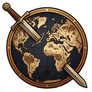
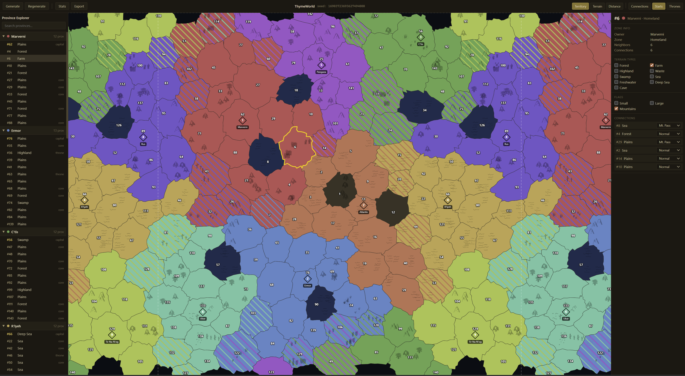
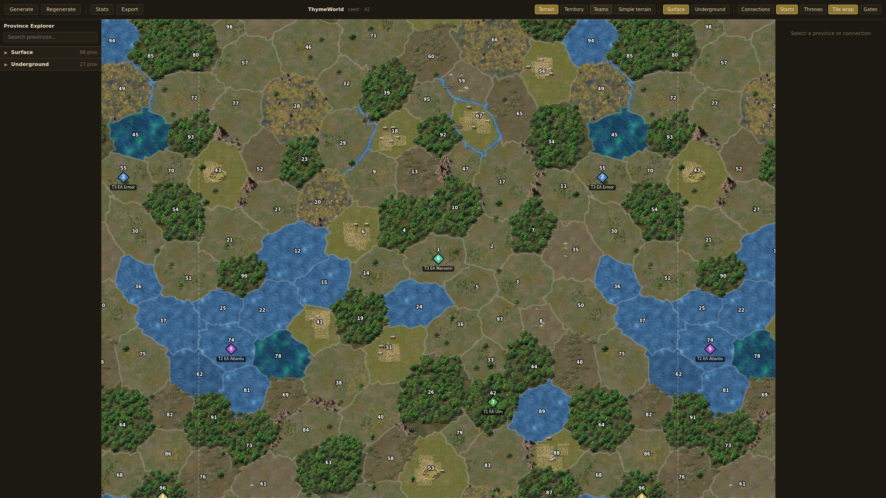
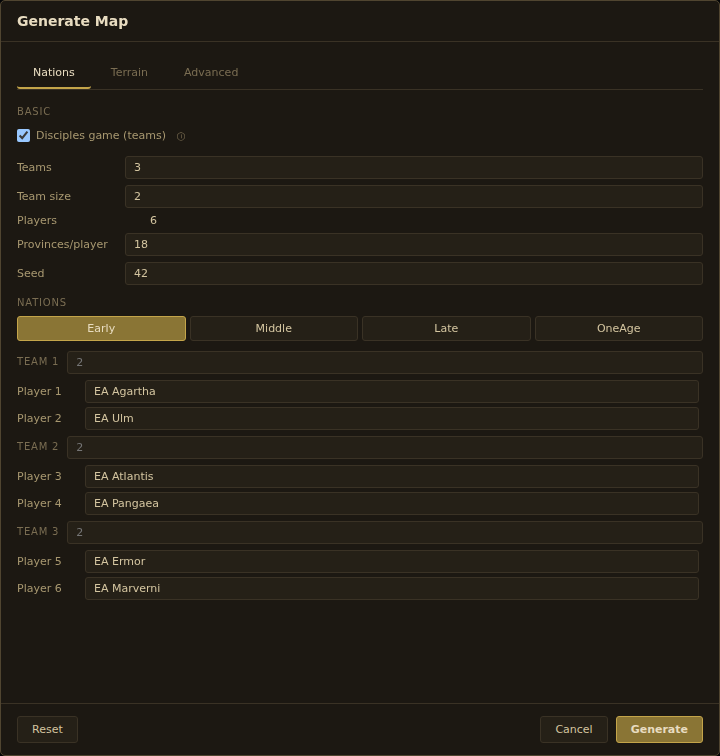
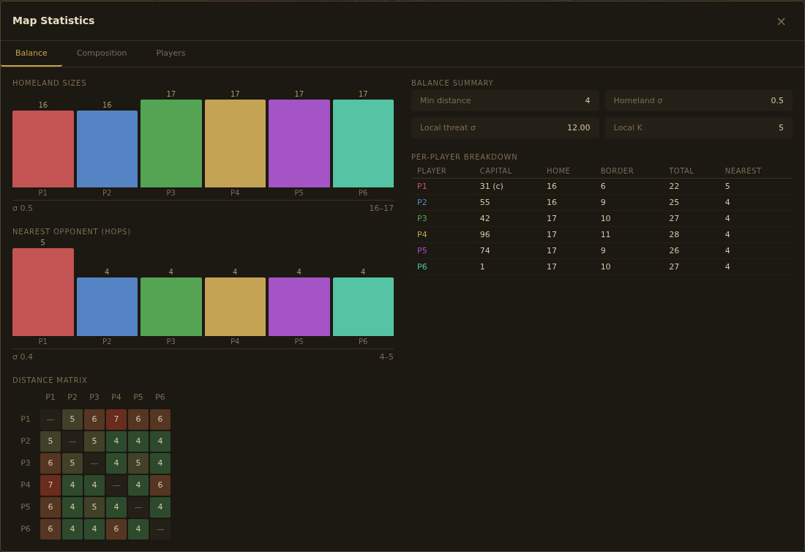

# ThymeWorld

A random map generator for [Dominions 6](https://www.illwinter.com/dom6/index.html).

## Screenshots

Territory lens

Terrain lens

Generation settings

Balance stats

## Download

Go to [Releases](https://github.com/DrThyme/ThymeWorld/releases) and download the latest version for your platform:

| Platform | File |
|----------|------|
| Windows  | `.msi` or `.exe` installer |
| macOS    | `.dmg` disk image |
| Linux    | `.AppImage` or `.deb` package |

## Usage

Launch the ThymeWorld app. Configure generation settings (player count, nations, terrain weights, etc.), generate a map, and export it. Copy the `.d6m` + `.map` files to your Dominions 6 maps folder.

## Supported

- Balanced start placement (simulated annealing with pluggable scoring presets)
- Nation-aware terrain assignment (138 nations with capital and ring biases)
- Full aquatic nation support with geometric clustering and terrain-aware materialization
- Toroidal (wrapping) maps
- Cosmetic coastlines, islands, decorative lakes, and river channels
- Web-based editor with province/connection editing, balance stats, and live preview
- Standalone desktop app (Windows, macOS, Linux) via Tauri
- Reproducible generation via seed

## Not Supported

- Multi-plane maps (no caves or underworld)
- Underground/cave nations
- Custom throne counts (always N thrones for N players)

## AI Disclosure

This application was developed with the assistance of AI (Claude). The logo was also AI-generated.

## Bug Reports

Found a bug? [Open an issue](https://github.com/DrThyme/ThymeWorld/issues).
